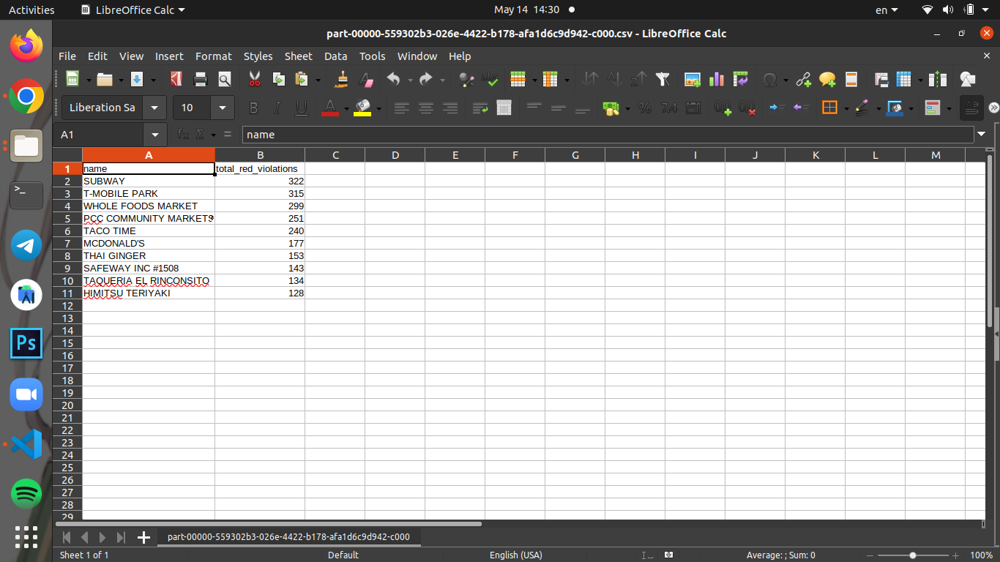

# Integration Solution Subject

[Video Link](your-link)

## Introduction
This is a Python based AWS EMR Spark application with LyveCloud as the datasource . The transfer_data.py transfers data from LyveCloud to AWS S3 making these data avalible for AWS EMR clusters to perform big data tasks on. 

## Requirements
* [Python3](https://www.python.org/downloads/)
* [AWS CLI](https://docs.aws.amazon.com/cli/latest/userguide/getting-started-install.html)
* AWS account with S3 bucket set up with all default settings (https://docs.aws.amazon.com/AmazonS3/latest/userguide/create-bucket-overview.html)
* Lyve Cloud account with bucket containing the dataset that is required for the big-data task. In this demo we have provided the food_establishment_data.csv which needs to be uploaded to the Lyve Cloud bucket.
* Big data scripts required to perform the desired task. In this demo we have provided the health_violations.py pyspark script.

## Known Limitations 
* From Step 6 onwards all the steps are only applicable to AWS EMR Spark applications. 
* The demo does not support transferring multiple buckets all at once and requires  changes to the config file each time we want to change the source and destination bucket.

##### Key areas to address during the challenge
* Security
Credentials are kept safe in AWS CLI profile
* Scalability
Allows for transfer of multiple scripts and objects(from the same bucket)
* Recovery
EMR logs are available in the logs S3 bucket

## Running Steps
**Step 1:** 
Create a profile with the following AWS credentials in AWS CLI:
   * access key
   * secret key
   * region name
Using the command: aws configure --profile <PROFILE_NAME>

**Step 2:** 
Repeat Step 1 with your Lyve Cloud credentials

**Step 3:** 
Fill in config.json with the following:
Lyve Cloud bucket credentials:
* Endpoint URL
* Name of Lyvecloud bucket storing data files
* List of paths to data files that is to be uploaded to AWS S3 bucket
AWS Credentials:
* Profile name for AWS CLI created in step 1
* Bucket name of destination AWS S3 bucket 
Scripts
* List of paths to scripts that is to be uploaded to AWS S3 bucket 

**Step 4:**
Run the transfer_data script in your console: `python3 transfer_data.py`.

**Step 5:**
Login to your AWS account and check your S3 bucket (https://console.aws.amazon.com/s3/) that the scripts and data files are uploaded. Also create an output folder for your results.
<p style="text-align:left"></p>

**Step 6:**
Create a EMR cluster at https://console.aws.amazon.com/elasticmapreduce/. For this demo, leave all options as it is except for Software Configuration, choose Spark: Spark 2.4.8 on Hadoop 2.10.1 YARN and Zeppelin 0.10.0 under application.  
<p style="text-align:left"></p>

**Step 7:**
Check your cluster status at https://console.aws.amazon.com/elasticmapreduce/. Wait until the status is WAITING before selecting the name of your newly created cluster

**Step 8:**
Go to steps, click on add steps and configure the step based on the screenshot:
<p style="text-align:left"></p>


For Application location enter the location of your health_violations.py script in Amazon S3. For example, s3://DOC-EXAMPLE-BUCKET/health_violations.py

In the Arguments field, enter the following arguments and values:

--data_source s3://DOC-EXAMPLE-BUCKET/food_establishment_data.csv
--output_uri s3://DOC-EXAMPLE-BUCKET/outputFolderName

**Step 9:**
Choose Add to submit the step. The step should appear in the console with a status of Pending.

<p style="text-align:left"></p>

You will know that the step finished successfully when the status changes to Completed.


## Results 
Check the output folder in your S3 bucket (https://console.aws.amazon.com/s3/). 
<p style="text-align:left"></p>

For this demo, you should have a csv file which contains the number of health violations for each food establishment.
<p style="text-align:left"></p>

## Tested by
* May 13-14, 2022: Zheng Shi Qiao (zheng_shiqiao@yahoo.com.sg) on Ubuntu 20.4

### Project Structure

This section will describe the representation of each of the folders or files in the structure.
```
.
├── README.md
├── code
│   └── dataset
│       └── food_establishment_data.csv
│   └── scripts
│       └── health_violations.py
│   └── config.json
│   └── requirements.txt
│   └── transfer_data.py
├── documentation
│   └── demo.mp4
│   └── introduction.pptx
└── images
    └── images for README
```

### `/code`
This folder contains all the code files.

### `/documentation`
This folder contains the demo video and presentation file.

### `/images`
This folder contains all the images.
